# Flutter Rounded Date Picker

The Flutter plugin that help you can choose dates and years with rounded calendars and customizable themes.

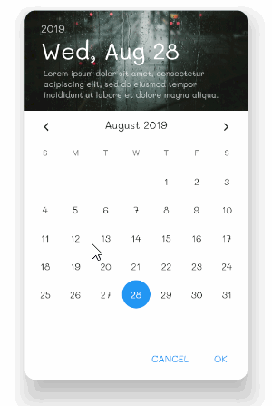
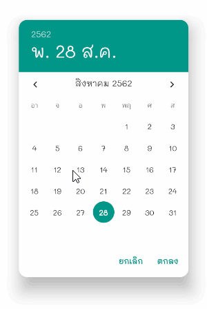
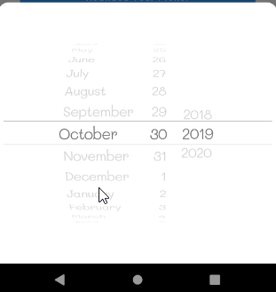
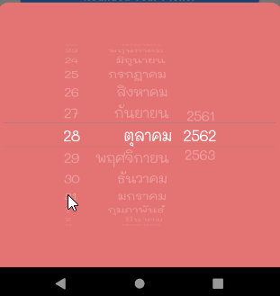

## Installing

Add dependencies in pubspec.yaml file. Add 2 things in it including flutter_localizations

```dart
dependencies:
  flutter_localizations:
    sdk: flutter
  flutter_rounded_date_picker: 2.0.2
```

## Importing

import packages into your dart.

```dart
import 'package:flutter_localizations/flutter_localizations.dart';
import 'package:flutter_rounded_date_picker/rounded_picker.dart';
```

## Initialize localizations

Add localization delegates in MaterialApp Widget and add languages that your app supports.

```dart
MaterialApp(
    localizationsDelegates: [
          GlobalMaterialLocalizations.delegate,
          GlobalWidgetsLocalizations.delegate,
    ],
    supportedLocales: [
          const Locale('en', 'US'), // English
          const Locale('th', 'TH'), // Thai
    ],
    ...
)
```

## Show Date Picker

Show date picker which you can specify a date that allows users to choose.

```dart
DateTime newDateTime = await showRoundedDatePicker(
  context: context,
  initialDate: DateTime.now(),
  firstDate: DateTime(DateTime.now().year - 1),
  lastDate: DateTime(DateTime.now().year + 1),
  borderRadius: 16,
),
```

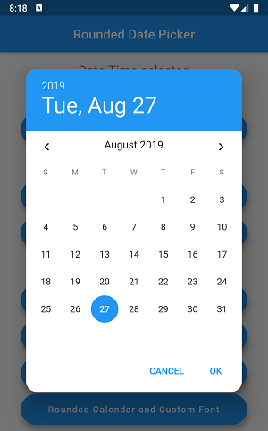
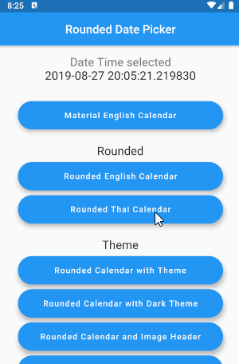

## Show Year Picker

Show year picker which you can specify a year start and end that allows users to choose.

```dart
DateTime newDateTime = await showRoundedDatePicker(
  context: context,
  initialDatePickerMode: DatePickerMode.year,
  theme: ThemeData(primarySwatch: Colors.green),
);
```

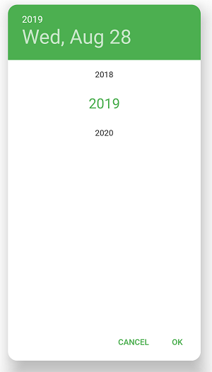

## Theme

You can assign themes to the date picker by using ThemeData class and PrimarySwatch.

```dart
DateTime newDateTime = await showRoundedDatePicker(
  context: context,
  theme: ThemeData(primarySwatch: Colors.pink),
);
```

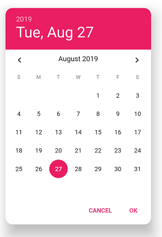

Dark theme

```dart
DateTime newDateTime = await showRoundedDatePicker(
  context: context,
  theme: ThemeData.dark(),
);
```

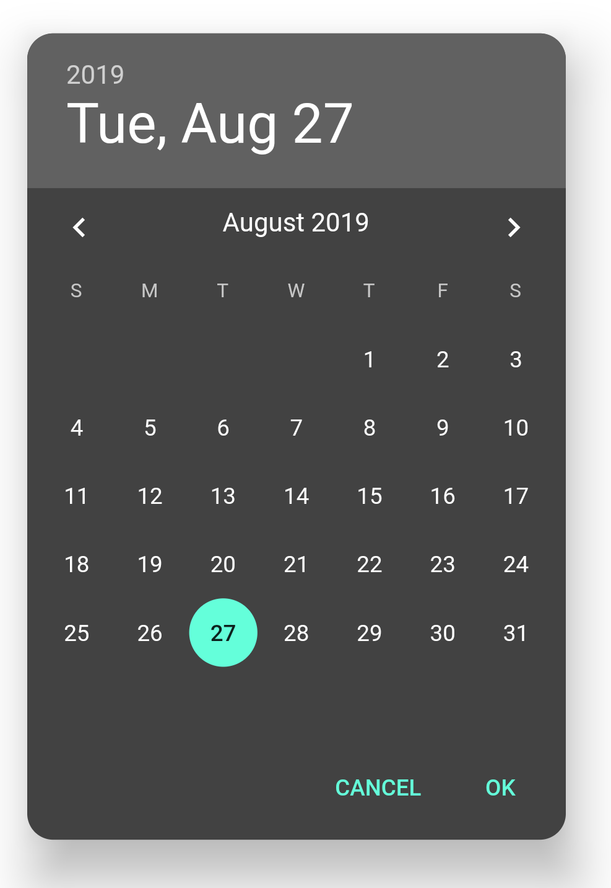

Custom Theme with ThemeData

```dart
DateTime newDateTime = await showRoundedDatePicker(
  context: context,
  background: Colors.white,
  theme: ThemeData(
    primaryColor: Colors.red[400],
    accentColor: Colors.green[800],
    dialogBackgroundColor: Colors.purple[50],
    textTheme: TextTheme(
      body1: TextStyle(color: Colors.red),
      caption: TextStyle(color: Colors.blue),
    ),
    disabledColor: Colors.orange,
    accentTextTheme: TextTheme(
      body2 : TextStyle(color: Colors.green[200]),
    ),
  ),
);
```

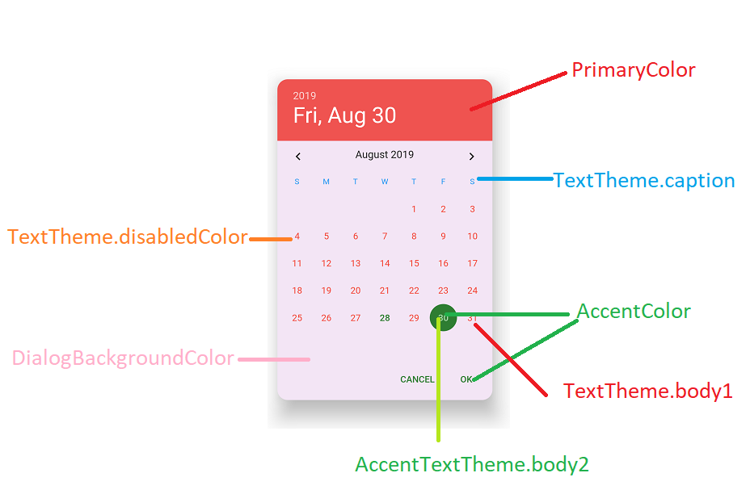


## Customize Date Picker

You can use styleDatePicker field for date picker style such as font size, weight, text color each part in the date picker.

Example custom font size and padding for displaying on a Tablet. (Pixel C, iPad 9.7")
```dart
DateTime newDateTime = await showRoundedDatePicker(
                        context: context,
                        theme: ThemeData(primarySwatch: Colors.deepPurple),
                        styleDatePicker: MaterialRoundedDatePickerStyle(
                          textStyleDayButton: TextStyle(fontSize: 36, color: Colors.white),
                          textStyleYearButton: TextStyle(
                            fontSize: 52,
                            color: Colors.white,
                          ),
                          textStyleDayHeader: TextStyle(
                            fontSize: 24,
                            color: Colors.white,
                          ),
                          textStyleCurrentDayOnCalendar:
                              TextStyle(fontSize: 32, color: Colors.white, fontWeight: FontWeight.bold),
                          textStyleDayOnCalendar: TextStyle(fontSize: 28, color: Colors.white),
                          textStyleDayOnCalendarSelected:
                              TextStyle(fontSize: 32, color: Colors.white, fontWeight: FontWeight.bold),
                          textStyleDayOnCalendarDisabled: TextStyle(fontSize: 28, color: Colors.white.withOpacity(0.1)),
                          textStyleMonthYearHeader:
                              TextStyle(fontSize: 32, color: Colors.white, fontWeight: FontWeight.bold),
                          paddingDatePicker: EdgeInsets.all(0),
                          paddingMonthHeader: EdgeInsets.all(32),
                          paddingActionBar: EdgeInsets.all(16),
                          paddingDateYearHeader: EdgeInsets.all(32),
                          sizeArrow: 50,
                          colorArrowNext: Colors.white,
                          colorArrowPrevious: Colors.white,
                          marginLeftArrowPrevious: 16,
                          marginTopArrowPrevious: 16,
                          marginTopArrowNext: 16,
                          marginRightArrowNext: 32,
                          textStyleButtonAction: TextStyle(fontSize: 28, color: Colors.white),
                          textStyleButtonPositive:
                              TextStyle(fontSize: 28, color: Colors.white, fontWeight: FontWeight.bold),
                          textStyleButtonNegative: TextStyle(fontSize: 28, color: Colors.white.withOpacity(0.5)),
                          decorationDateSelected: BoxDecoration(color: Colors.orange[600], shape: BoxShape.circle),
                          backgroundPicker: Colors.deepPurple[400],
                          backgroundActionBar: Colors.deepPurple[300],
                          backgroundHeaderMonth: Colors.deepPurple[300],
                        ),
                        styleYearPicker: MaterialRoundedYearPickerStyle(
                          textStyleYear: TextStyle(fontSize: 40, color: Colors.white),
                          textStyleYearSelected:
                              TextStyle(fontSize: 56, color: Colors.white, fontWeight: FontWeight.bold),
                          heightYearRow: 100,
                          backgroundPicker: Colors.deepPurple[400],
                        ));
```  
        
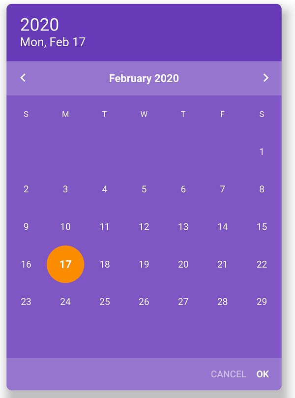

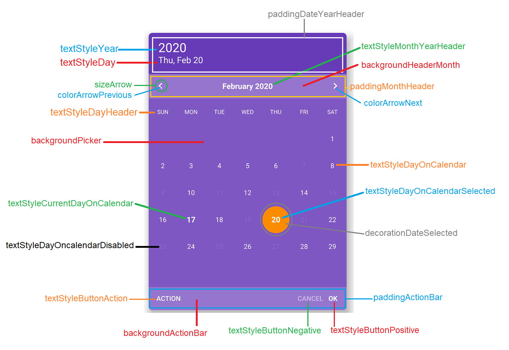

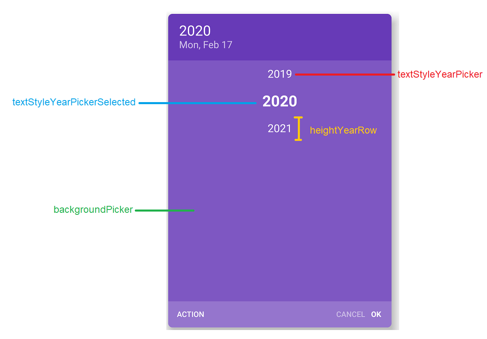

### Custom action button and text on button.

Added the action button and the button's custom text.

```dart
DateTime newDateTime = await showRoundedDatePicker(
                        ...
                        textActionButton: "ACTION",
                        onTapActionButton: (){
                           //
                        },
                        textPositiveButton: "OK",
                        textNegativeButton: "CANCEL");
```  

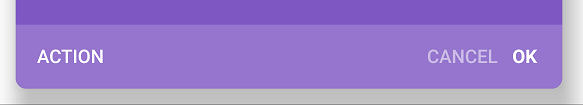

### Custom weekday header text.

Customize the header of the weekday.

```dart
DateTime newDateTime = await showRoundedDatePicker(
                        ...
                        customWeekDays: ["SUN", "MON", "TUE", "WED", "THU", "FRI", "SAT"]);
```  

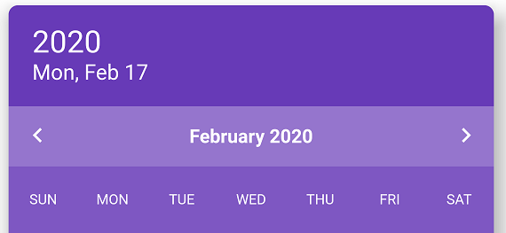

### Custom disabled date.

Add closed date cannot be selected.

```dart
DateTime newDateTime = await showRoundedDatePicker(
                        ...
                        listDateDisabled: [
                                                  DateTime.now().subtract(Duration(days: 2)),
                                                  DateTime.now().subtract(Duration(days: 4)),
                                                  DateTime.now().subtract(Duration(days: 6)),
                                                  DateTime.now().subtract(Duration(days: 8)),
                                                  DateTime.now().subtract(Duration(days: 10)),
                                                  DateTime.now().add(Duration(days: 2)),
                                                  DateTime.now().add(Duration(days: 4)),
                                                  DateTime.now().add(Duration(days: 6)),
                                                  DateTime.now().add(Duration(days: 8)),
                                                  DateTime.now().add(Duration(days: 10)),
                                                ]);
```  

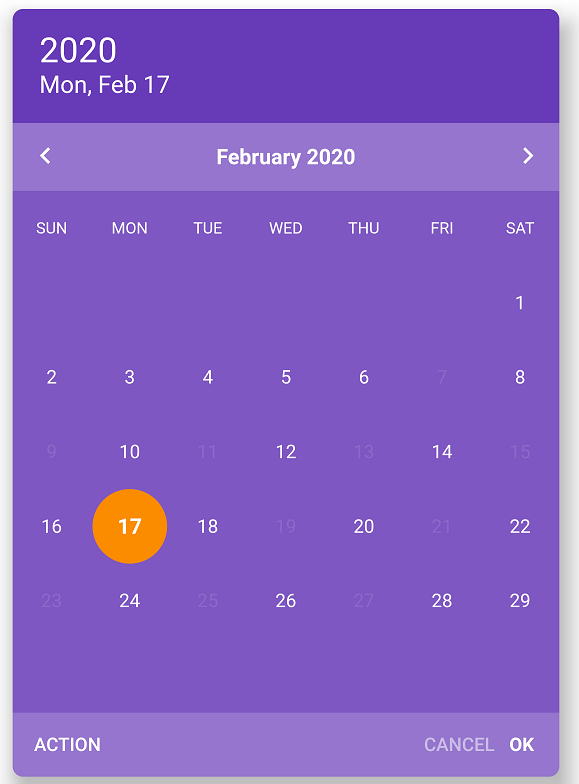

### Custom callback on tap day.

Add callback when tap on day.

```dart
DateTime newDateTime = await showRoundedDatePicker(
                        ...
                        onTapDay: (DateTime dateTime, bool available) {
                          if (!available) {
                            showDialog(
                                context: context,
                                builder: (c) => CupertinoAlertDialog(title: Text("This date cannot be selected."),actions: <Widget>[
                                  CupertinoDialogAction(child: Text("OK"),onPressed: (){
                                    Navigator.pop(context);
                                  },)
                                ],));
                          }
                          return available;
                        });
```  

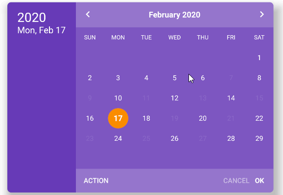

### Custom builder day on date picker.

Customize the display format of the day widget.

```dart
DateTime newDateTime = await showRoundedDatePicker(
                        ...
                        builderDay:
                            (DateTime dateTime, bool isCurrentDay, bool isSelected, TextStyle defaultTextStyle) {
                          if (isSelected) {
                            return Container(
                              decoration: BoxDecoration(color: Colors.orange[600], shape: BoxShape.circle),
                              child: Center(
                                child: Text(
                                  dateTime.day.toString(),
                                  style: defaultTextStyle,
                                ),
                              ),
                            );
                          }

                          if (dateTime.day == 10) {
                            return Container(
                              decoration: BoxDecoration(
                                  border: Border.all(color: Colors.pink[300], width: 4), shape: BoxShape.circle),
                              child: Center(
                                child: Text(
                                  dateTime.day.toString(),
                                  style: defaultTextStyle,
                                ),
                              ),
                            );
                          }
                          if (dateTime.day == 12) {
                            return Container(
                              decoration: BoxDecoration(
                                  border: Border.all(color: Colors.pink[300], width: 4), shape: BoxShape.circle),
                              child: Center(
                                child: Text(
                                  dateTime.day.toString(),
                                  style: defaultTextStyle,
                                ),
                              ),
                            );
                          }

                          return Container(
                            child: Center(
                              child: Text(
                                dateTime.day.toString(),
                                style: defaultTextStyle,
                              ),
                            ),
                          );
                        });
```  

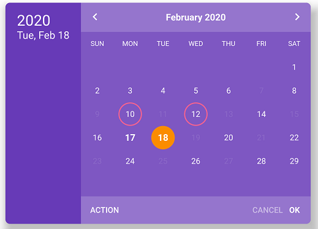

## Image Background Header

Use images as the header of the date picker and you can also add more details.

* You need to specify the path of images in your asset (pubspec.yaml).

```dart
DateTime newDateTime = await showRoundedDatePicker(
  context: context,
  theme: ThemeData(primarySwatch: Colors.blue),
  imageHeader: AssetImage("assets/images/calendar_header.jpg"),
  description: "Lorem ipsum dolor sit amet, consectetur adipiscing elit, sed do eiusmod tempor incididunt ut labore et dolore magna aliqua.",
);
```

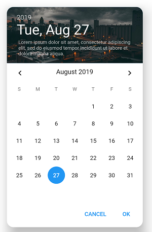

## Customize Font in Date Picker

You can adjust the Font-family in the date picker.

* You need to specify the path of font in your fonts (pubspec.yaml).

```dart
DateTime newDateTime = await showRoundedDatePicker(
  context: context,
  fontFamily: "Mali"
);
```

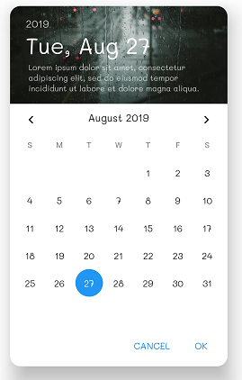

## Date Picker Locale

You can set the date picker locale. By specifying the language code and country code.
As of April 2019, this package supports about 52 languages.

```dart
DateTime newDateTime = await showRoundedDatePicker(
  context: context,
  locale: Locale("zh","CN"),
  theme: ThemeData(primarySwatch: Colors.pink),
);
```

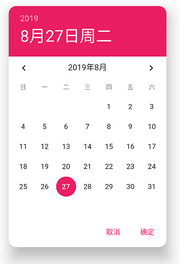

## Thai and Buddhist Year

If you are using Thai language And use the Buddhist era (543 BCE). Plugins that support these capabilities.

```dart
DateTime newDateTime = await showRoundedDatePicker(
  context: context,
  locale: Locale("th", "TH"),
  era: EraMode.BUDDHIST_YEAR,
);
```

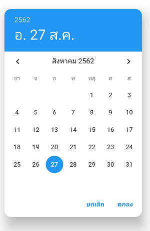

## Show Time Picker

Show time picker, all feature of date picker is available (except description)

```dart
final timePicked = await showRoundedTimePicker(
  context: context,
  initialTime: TimeOfDay.now(),
);
```

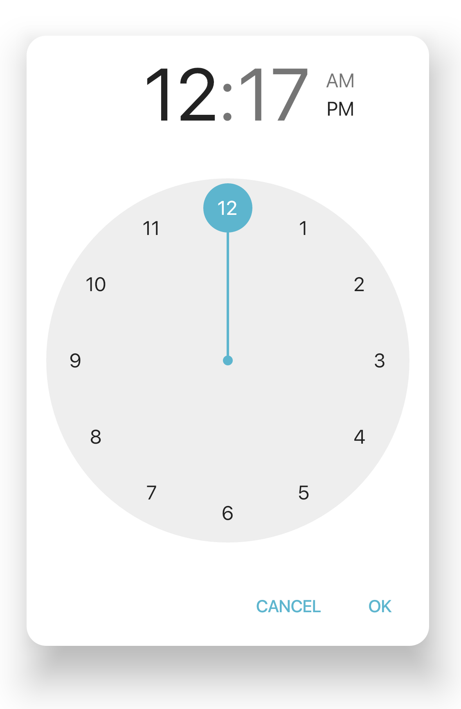

# Cupertino Date Picker

Show date and duration picker iOS style.

## Installing

Add Flutter Cupertino Localizations in dependencies pub.yaml.

```yaml
dependencies:
  flutter:
    sdk: flutter
  flutter_localizations:
    sdk: flutter
  flutter_cupertino_localizations: 1.0.1
```

## Initialize localizations

Add CupertinoLocalizations delegate to localizations delegate on your App.
The cupertino date picker will use current app locale in picker.

```dart
MaterialApp(
  debugShowCheckedModeBanner: false,
  localizationsDelegates: [
    GlobalMaterialLocalizations.delegate,
    GlobalWidgetsLocalizations.delegate,
    DefaultCupertinoLocalizations.delegate,
    GlobalCupertinoLocalizations.delegate,  // Add global cupertino localiztions.
  ],
  locale: Locale('en', 'US'),  // Current locale
  supportedLocales: [
    const Locale('en', 'US'), // English
    const Locale('th', 'TH'), // Thai
  ],
)
```

## Show Cupertino Date Picker

Call the method for displaying date picker.
The callback date time instance will be return with onDateTimeChange.

```dart
CupertinoRoundedDatePicker.show(
  context,
  fontFamily: "Mali",
  textColor: Colors.white,
  background: Colors.red[300],
  borderRadius: 16,
  initialDatePickerMode: CupertinoDatePickerMode.date,
  onDateTimeChanged: (newDateTime) {
    //
  },
);
```

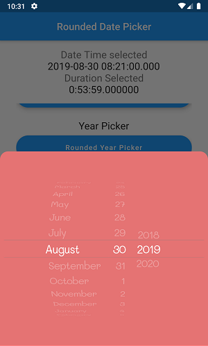

More Cupertino Date Picker Mode

```dart
CupertinoDatePickerMode.date
CupertinoDatePickerMode.dateAndTime
CupertinoDatePickerMode.time
```

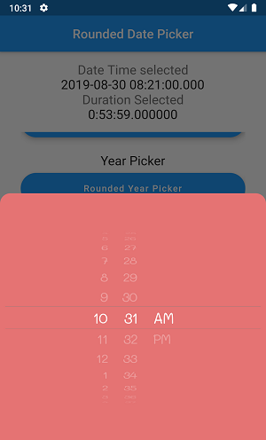
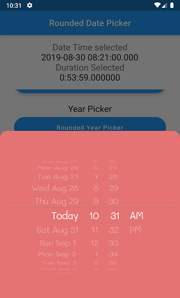

using Thai and Buddhist Year

```dart
/// Current locale is TH.
CupertinoRoundedDatePicker.show(
  context,
  fontFamily: "Mali",
  textColor: Colors.white,
  era: EraMode.BUDDHIST_YEAR,
  background: Colors.red[300],
  borderRadius: 16,
  initialDatePickerMode: CupertinoDatePickerMode.date,
  onDateTimeChanged: (newDateTime) {
    //
  },
);
```

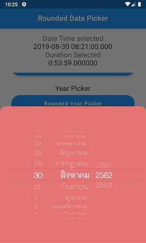

## Cupertino Duration Picker

in iOS , Flutter cupertino support duration and timer picker.

```dart
CupertinoRoundedDurationPicker.show(
  context,
  initialTimerDuration: Duration(minute:10),
  initialDurationPickerMode: CupertinoTimerPickerMode.hms,
  fontFamily: "Mali",
  onDurationChanged: (newDuration) {
    //
  },
);
```

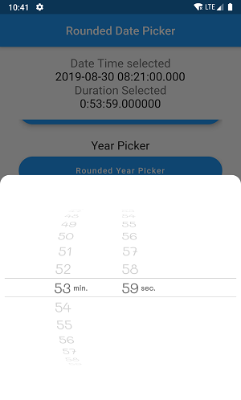

More Cupertino Duration Picker Mode

```dart
CupertinoTimerPickerMode.hms
CupertinoTimerPickerMode.hm
CupertinoTimerPickerMode.ms
```

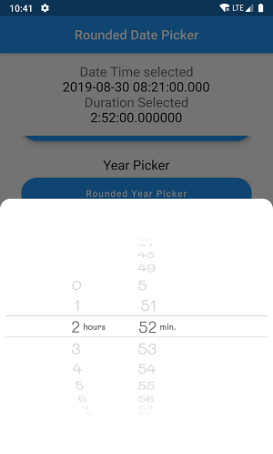
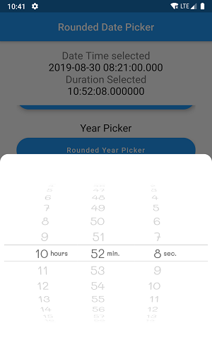

## Thanks
[felixgabler](https://github.com/felixgabler)
